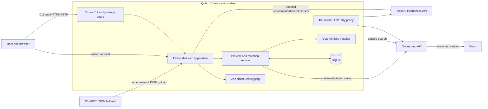
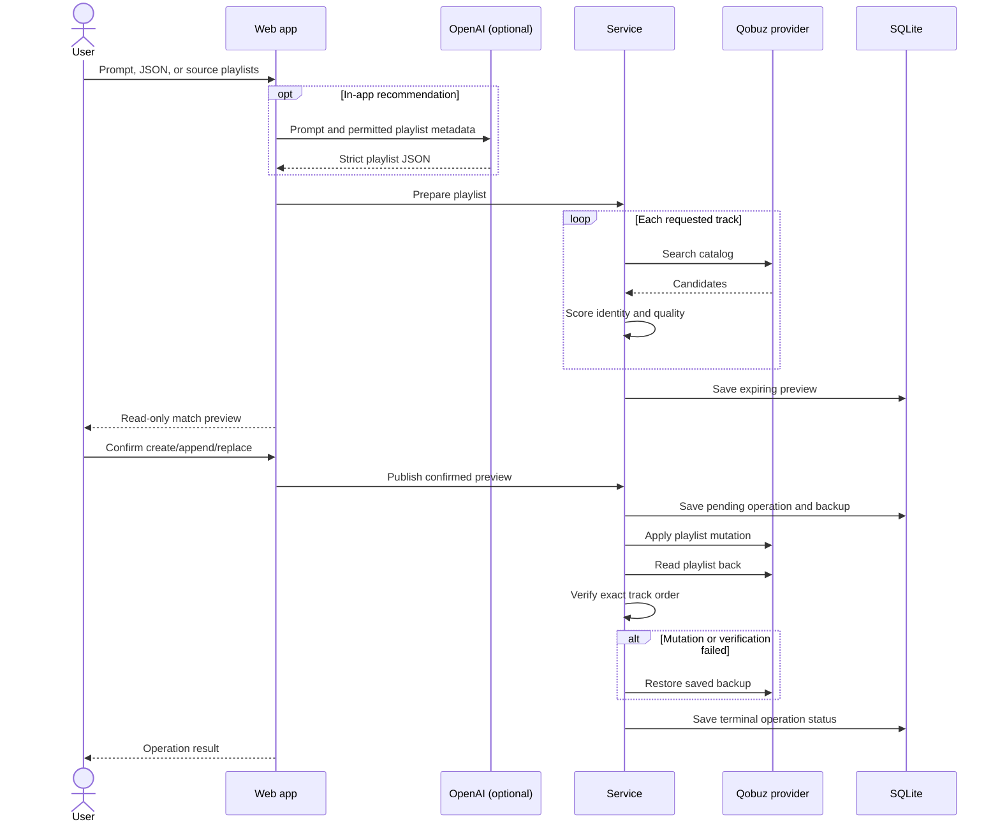
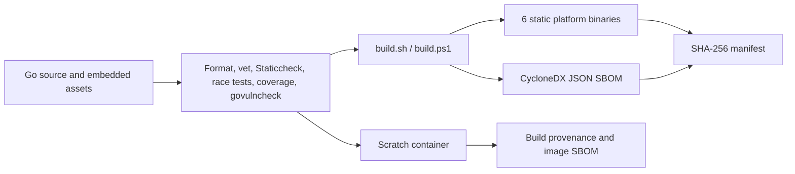

# Qobuz Curator architecture

Qobuz Curator is a local-first, single-user Go application. One executable
contains the command-line interface, HTTP server, web assets, matching logic,
OpenAI integration, Qobuz adapter, and SQLite persistence. The only runtime
dependency is a writable data directory.

## System context

The browser and CLI are trusted user interfaces. OpenAI and Qobuz are external
trust boundaries. Playlist names, prompts, and track metadata crossing those
boundaries are treated as untrusted data. Credentials are added only as HTTP
headers by their respective clients and are never put into playlist JSON or
SQLite records.

## Package responsibilities

| Package | Responsibility |
|---|---|
| `main` | Rejects elevated execution, creates a signal-aware root context, initializes boot logging, and returns process exit status. |
| `internal/cli` | Colorful Cobra commands, interactive configuration initialization, terminal spinners, HTTP lifecycle, browser launch, and atomic configuration/credential-file updates. |
| `internal/config` | Configdir placement, Viper precedence, safe initial/runtime defaults, logging settings, validation, URL policy, and cryptographic session-secret generation. |
| `internal/logging` | Zap console/JSON encoders, colored levels, and critical-event convention. |
| `internal/privilege` | Cross-platform root/elevated-token detection and refusal. |
| `internal/httpretry` | Safe-operation classification, bounded attempts, jittered backoff, `Retry-After`, and cancellation. |
| `internal/model` | Provider-independent playlist, catalog, preview, operation, and backup contracts. |
| `internal/matching` | Normalization, identity scoring, confidence thresholds, and quality tie-breaking. |
| `internal/recommend` | OpenAI Responses API requests, strict JSON Schema output, and source-playlist prompt construction. |
| `internal/provider` | Provider interface, deterministic fake provider, and isolated Qobuz private-web-API adapter. |
| `internal/service` | Preview creation and verified create, append, replace, rollback, and restore workflows. |
| `internal/store` | Private SQLite database, schema creation, operations, previews, and atomic mutation backups. |
| `internal/security` | Bounded scrypt password hashes, signed expiring sessions, and constant-time CSRF validation. |
| `internal/qobuzauth` | Loopback-only browser authorization callback and Qobuz token exchange. |
| `internal/webapp` | Embedded templates/static files/schema, HTTP routing, authentication, rate limiting, and security middleware. |

The `provider.Provider` and `recommend.Recommender` interfaces keep network code
outside the orchestration layer. Tests substitute the fake provider and local
`httptest` servers, so the test suite never contacts Qobuz or OpenAI.

## Request and publication flow

Preview creation is read-only. A playlist write requires a signed session, a
valid CSRF token, an unexpired preview, and an explicit confirmation field.
Append and replace operations do not begin until the pending audit record and a
complete destination backup commit in one SQLite transaction. The service then
reads the remote playlist back and verifies its exact track order. A failed
mutation triggers an immediate rollback; its result is recorded as
`rolled_back` or `rollback_failed`.

All mutation and restore workflows share a process-local mutex. This is a
deliberate coarse-grained lock: a personal application values a fully ordered
backup/write/verify/rollback sequence over parallel remote writes. Catalog
searches and previews remain concurrent, and the fake provider and web session
registries protect their own shared state.

Appending filters out tracks already present because Qobuz is called with its
no-duplicates behavior. Replacing or backing up a playlist is refused if Qobuz
returns fewer tracks than its reported count.

## Persistence

SQLite stores three JSON-backed record types:

- `previews`: immutable matching results with creation and expiration times.
- `operations`: pending and terminal publication audit records.
- `backups`: the complete pre-mutation provider playlist for append/replace.

SQLite uses WAL mode, a five-second busy timeout, foreign-key enforcement, and
a single connection appropriate to this one-process workload. The data
directory is created with user-only permissions and the main database is
restricted to mode `0600` where the operating system supports POSIX modes.
This is operational safety, not encryption; use an encrypted NAS volume when
playlist history is sensitive.

## Web security model

The native default listener is `127.0.0.1:0`: the kernel atomically reserves an
available high port and the CLI prints the actual URL. Docker uses fixed
private-range port `49277` and Compose publishes it only on host loopback.
Browser requests receive a restrictive Content Security
Policy, anti-framing and MIME-sniffing headers, no-referrer policy, and
`no-store` caching for dynamic responses. Request bodies and uploaded files are
bounded.

Forms that can wait on OpenAI, Qobuz, or scrypt display an accessible embedded
spinner overlay. Its JavaScript and CSS are served from the embedded filesystem
and allowed by a self-only Content Security Policy; no CDN or inline script is
required.

Host-header validation permits loopback plus explicitly configured
`allowed_hosts`, mitigating DNS rebinding. Authentication uses bounded scrypt
hash parameters and login throttling. Password checks are serialized so
concurrent requests cannot multiply scrypt's memory cost, and both the login
client map and active-session registry have hard bounds. Sessions are
HMAC-signed, expire, use HttpOnly/SameSite=Strict cookies, and are also tracked
in process so logout revokes the current cookie. A restart deliberately logs
authenticated users out. Enable `secure_cookies` only when the browser always
reaches the service through HTTPS.

The application does not trust `X-Forwarded-*` headers. A reverse proxy is
responsible for TLS termination and its own edge request limits, but the app's
security decisions continue to use the direct peer and configured host list.

## Deployment model and limits

The supported deployment is one process or one container with one writable
data directory. Running multiple replicas against the same SQLite database is
outside the design. The container runs as UID/GID 65532, has a read-only root
filesystem, drops all Linux capabilities, and writes only to `/data` and a
small no-exec temporary filesystem.

Qobuz does not publish a stable consumer playlist API. The adapter uses the
current web-player endpoints, so upstream changes can break authentication or
playlist operations. The adapter is intentionally isolated, responses are
size-bounded, and destructive operations fail closed when a complete backup
cannot be established. Even with these safeguards, test releases against a
disposable playlist before relying on them.

OpenAI recommendations use strict structured outputs and request
`store: false`. Only prompts and selected playlist metadata are sent; audio,
Qobuz credentials, and OpenAI credentials are not. Source playlist count,
track count, and serialized metadata size are bounded before an API request is
created. The generated playlist is still treated as untrusted input and must
pass local validation and Qobuz matching before it can be published.

## Network resilience and observability

The shared HTTP retry layer recreates every request body per attempt and drains
discarded responses so connections can be reused. Transport failures and
eligible 408, 425, 429, and transient 5xx responses use at most three attempts,
exponential backoff with jitter, a capped `Retry-After`, and context-aware
sleep. OpenAI's explicit `X-Should-Retry: false` wins. A 429 without
`Retry-After` is treated as a potentially permanent quota failure.

Retry classification is based on semantics, not just HTTP method. Qobuz reads
and OpenAI recommendation generation (`store: false`) are retryable. Qobuz
playlist writes and one-time authorization-code exchange are not. This avoids
turning an ambiguous network response into a duplicate remote mutation.

Zap emits structured events from debug through error; process-threatening and
rollback-failed events add `severity=critical`. Console encoding supports ANSI
level colors, while JSON encoding is suitable for Docker and collectors. Logs
include request paths but deliberately exclude query strings, bodies, prompts,
cookies, tokens, and authorization codes.

## Build and supply-chain flow

Both local release scripts invoke the same pinned CycloneDX generator and fail
closed if SBOM generation fails. An independent CI job uploads binaries,
checksums, license, documentation, and SBOM on every run. Default-branch and tagged
container publications additionally carry BuildKit provenance and an image
SBOM.

## Extension points

Add another music service by implementing `provider.Provider`; no web or
service-layer change should be necessary. Add another recommendation engine by
implementing `recommend.Recommender`. Schema changes require synchronized
updates to `internal/model`, both schema copies, templates, prompts, and
compatibility tests.
